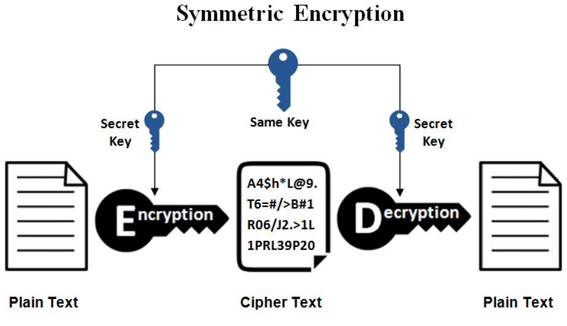

# Akita notes

> Minhas notas e códigos dos vídeos do [Fabio Akita](https://www.youtube.com/@Akitando)

## Conteúdo

 - [**O guia DEFINITIVO do UBUNTU para desenvolvedores iniciantes:**](https://www.youtube.com/watch?v=epiyExCyb2s)
   - [Criptografia Simétrica (Symmetric Encryotion)](#symmetric-encrytion)
   - [Criptografia Assimétrica  (Asymmetric Encrytion)](#asymmetric-encrytion)
     - [Exemplo de Criptgrafia Assimétrica](#ex-keys)
<!--- 
[WHITESPACE RULES]
- Different topic = "50" Whitespace character.
--->

<!-- ( O guia DEFINITIVO do UBUNTU para desenvolvedores iniciantes ) --->

---

# Criptografia Simétrica (Symmetric Encryotion)

 - A **Criptografia Simétrica (também conhecida como Criptografia de Chave Secreta/ou Compartilhada** é uma técnica que utiliza uma `única chave (Secret Key)` para *"criptografar"* e *"descriptografar"* os dados.  
 - **A Criptografia Simétrica** trabalha apenas com a chave privada. Ela é usada para codificar e decodificar a mensagem, nos 2 sentidos, garantindo a confidencialidade dos dados.

  

> **NOTE:**  
> Vejam que a mesma chave foi utilizada para criptografar e descriptografar os dados.

---

## Criptografia Assimétrica  (Asymmetric Encrytion)

> Na categoria de **Criptografia Assimétrica (Asymmetric Encrytion)** temos 2 chaves que costumam ser `2 números primos relacionados`.

 - **Chave Privada (Private Key):**
   - Por convenção, um desses números primo é chamado de `Chave Privada (Private Key)` e ela nunca deve ser distribuida.
 - **Chave Publica (Public Key):**
   - O outro número primo vai representar nossa `Chave Publica (Public Key)` e ela pode ser distribuida para quem precisa.

  

 - **Tudo o que for criptografado com a Chave Privada (Private Key):**
   - Só pode ser descriptografado com a *"Chave Publica (Public Key)"*.
 - **E tudo o que for criptografado com a Chave Publica (Public Key):**
   - Só pode ser descriptografado com a *"Chave Privada (Private Key)"*.

---

## Exemplo de Criptgrafia Assimétrica

Agora vamos ver um exemplo de **Criptografia Assimétrica (Asymmetric Encrytion)**:

 - **Chave Pública (Public Key):**
   - Serviços como *GitHub*, *AWS*, *Google Cloud* exigem que você cadastre sua Chave `Públic (Public Key)`.
 - **Chave Privada (Private Key):**
   - Se eu assinar um comite no meu repositório local com minha `Chave Privada (Private key)`, o GitHub poderá verificar se foi eu mesmo que assinei esse comite utilizando minha `Chave Publica (Public Key)` que foi disponibilizada no GitHub.

---

**Rodrigo** **L**eite da **S**ilva
