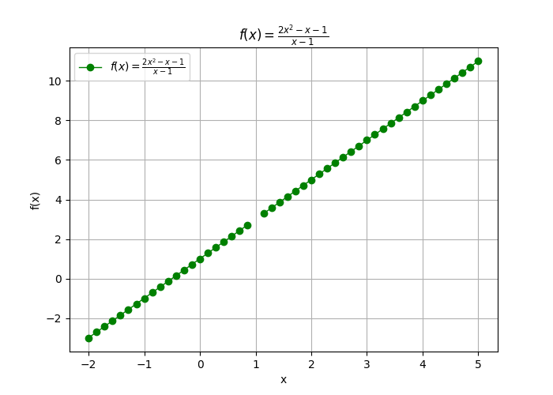
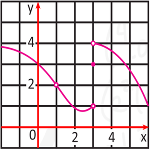
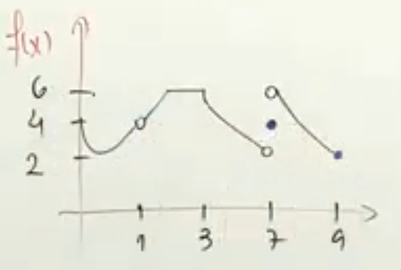
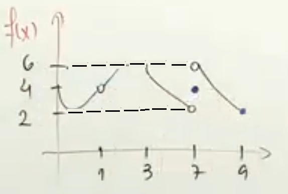

# Calculus

## Contents

 - [**Taxa de Variação**](#intro-to-rate-of-change)
   - [Taxa de Variação Linear](#linear-rate-of-change)
 - [**Limite**](#intro-to-limit)
   - [Limites laterais](#one-sided-limit)
 - [**Derivada**](#intro-to-derivative)
 - [**Integral**](#intro-to-integral)
 - **DICAS & TRUQUES:**
   - [Notação de Intervalo](#interval-notation)
 - [**Configurações**](#settings)
 - [**REFERÊNCIAS**](#ref)
<!---
[WHITESPACE RULES]
- Same topic = "10" Whitespace character.
- Different topic = "50" Whitespace character.
--->


<!--- ( Taxa de Variação ) --->

---

<div id="intro-to-rate-of-change"></div>

## Taxa de Variação

A **Taxa de Variação** indica:

 - A *rapidez (velocidade)* e a *direção* da mudança de uma *variável dependente (y)*.
 - Em relação à variação da *variável independente (𝑥)*.

> **NOTE:**  
> Em **Funções Lineares**, essa *taxa* é *constante*, enquanto em **Funções Não Lineares**, ela pode variar dependendo do valor de 𝑥.


---

<div id="linear-rate-of-change"></div>

## Taxa de Variação Linear

Para entender a **"Taxa de Variação Linear"**, vamos começar com a seguinte *função q(x)*, que retorna:

- O número de **metros (variável dependente y)** percorridos por um ciclista.
- Com base no número de **segundos (variável independente x)** que o ciclista pedalou a bicicleta.

**Imagine que a função seja esta:**  
  
<!---
\mathbf{q(x) = 2x + 1}
--->


<details>
<summary>Código Python</summary>

[meters_travelled_by_cyclist.py](src/meters_travelled_by_cyclist.py)
```python
from matplotlib import pyplot as plt
import numpy as np

def q(x):
    return 2 * x + 1

if __name__ =='__main__':
    x = np.array(range(0, 10+1))

    plt.figure(figsize=(7, 5))  # Largura(Width), Height(Altura).
    plt.plot(x, q(x), color='green', marker='o')
    plt.title("q(x) = 2x + 1")
    plt.xlabel('Segundos')
    plt.ylabel('Metros')
    plt.xticks(range(0, 10+1, 1))
    plt.yticks(range(0, 21+1, 1))
    plt.grid()
    plt.savefig("../images/rate-of-change-01.png")
    plt.show()
```

</details>

  

Olhando para o gráfico acima, podemos ver:

- **Quantos *segundos (variável independente x)* o ciclista percorreu:**  
  - 10 segundos.

- **Quantos *metros (variável dependente y)* foram percorridos por segundo:**  
  - 1 segundo  = 3 metros.  
  - 2 segundos = 5 metros.  
  - 3 segundos = 7 metros.  
  - 4 segundos = 9 metros.  
  - 5 segundos = 11 metros.  
  - 6 segundos = 13 metros.  
  - 7 segundos = 15 metros.  
  - 8 segundos = 17 metros.  
  - 9 segundos = 19 metros.  
  - 10 segundos = 21 metros.  

Se prestarmos atenção, podemos ver:

 - Quanto de distância muda a cada segundo percorrido, que é de `2 metros por segundo`.
 - **NOTE:** Isso ocorre porque nossa função é linear (constante) e a variação (y<sub>1</sub> para y<sub>2</sub>) é a mesma (constante) de um valor de x para outro.  

> **Olhando para o gráfico é fácil, mas como identificar essa *mudança (Taxa de Variação)* para qualquer função linear?**

Para resolver isso nós podemos utilizar a seguinte formula:

  
<!---
\mathbf{m = \frac{\Delta y}{\Delta x} = \frac{q(x)_{2} \ - \ q(1)_{1}}{x_{2} \ - \ x_{1}} = \frac{y_{2} \ - \ y_{1}}{x_{2} \ - \ x_{1}}}
--->

Ou seja, nós vamos precisar de apenas dois pares ordenados de valores **x** e **y** para aplicar na equação (formula):

- **Após 1 segundo:**  
  - *"x"* é *"1"*.  
  - *"y"* é *"3"*.  

- **Após 10 segundos:**  
  - *"x"* é *"10"*.  
  - *"y"* é *"21"*.  

Logo:

  
<!---
\\\mathbf{m = \frac{21 \ - \ 3}{10 \ - \ 1} = \frac{18}{9} = 2}
\\
\\\mathbf{ m = 2}
--->

> **Mas o que esse "2" significa?**

 - Significa que a nossa *variável dependente (y)* está mudando (aumentando ou diminuindo) 2 em relação a *variável independente (x)*.
 - Ou seja, o ciclista está percorrendo `2 metros por segundo`.


<!--- ( Limite ) --->

---

<div id="intro-to-limit"></div>

## Limite

Para entendermos sobre **"Limites"**, vamos imaginar que temos a seguinte função:


<!---
\mathbf{f(x) = \frac{2x^{2} \ - \ x \ - 1}{x \ - \ 1}}
--->

De início, vamos testar essa função para `x = 0`:

  
<!---
\\\mathbf{f(x) = \frac{2x^{2} \ - \ x \ - 1}{x \ - \ 1} = \frac{2 \times 0^{2} - 0 - 1}{0 - 1} = \frac{2 x 0 - 0 - 1}{-1} = \frac{0 - 0 - 1}{-1} = \frac{-1}{-1}}
\\
\\\mathbf{f(x) = \frac{-1}{-1}} 
--->

Agora, vamos testar a função para `x = 1`:

  
<!---
\\\mathbf{f(x) = \frac{2x^{2} \ - \ x \ - \ 1}{x \ - \ 1} = \frac{2 \times 1^{2} - 1 - 1}{1 - 1} = \frac{2 \times 1 - 1 - 1}{0} = \frac{2 - 1 - 1}{0} = \frac{0}{0}}
\\
\\\mathbf{f(x) = \frac{0}{0}}
--->

> **Como assim?**  
> Não tem como dividir por zero!

 - **No contexto de limites, isso é o que conhecemos como:**
   - *"Indeterminação"* ou *"Razão indeterminada"*.
   - **NOTE:** Também podemos dizer que *"1" está fora do domínio da minha função* (neste exemplo).

Para entender melhor vamos ver isso visualmente:

<details><summary>Python Code</summary>

```python
from matplotlib import pyplot as plt
import numpy as np

# Remove warnings.
import warnings
warnings.filterwarnings(
    "ignore",
    category=RuntimeWarning,
    message="invalid value encountered in divide"
)

def f(x):
    return (2 * x**2 - x - 1) / (x - 1)


def check_indeterminate(x, y):
    indeterminate_indices = []
    for i, (x, y) in enumerate(zip(x_list, y_list)):
        if x == 1 and y == 0:  # Example condition for indeterminate case
            indeterminate_indices.append(i)  # Add index where indeterminate occurs
    return indeterminate_indices


def createGraph(x, y):
    plt.figure(figsize=(7, 5))  # Width, height.
    plt.plot(x, f(x), color='green', marker='o', linewidth=1, label=r"$f(x) = \frac{2x^{2} - x - 1}{x - 1}$")
    plt.title(r"$f(x) = \frac{2x^{2} - x - 1}{x - 1}$")
    plt.xlabel('x')
    plt.ylabel('f(x)')
    plt.grid()
    plt.legend()
    plt.savefig("../images/limit-fx-01.png")
    plt.show()


if __name__ == '__main__':

    x = np.linspace(-2, 5)  # Generate points to from -2 to 5.
    y = f(x)                # Compute the corresponding y values.

    # Print x and y values.
    for xi, yi in zip(x, y):
        print(f"x: {xi:.4f}, y: {yi:.4f}")

    createGraph(x, y)
```

**OUTPUT:**
```
x: -2.0000, y: -3.0000
x: -1.8571, y: -2.7143
x: -1.7143, y: -2.4286
x: -1.5714, y: -2.1429
x: -1.4286, y: -1.8571
x: -1.2857, y: -1.5714
x: -1.1429, y: -1.2857
x: -1.0000, y: -1.0000
x: -0.8571, y: -0.7143
x: -0.7143, y: -0.4286
x: -0.5714, y: -0.1429
x: -0.4286, y: 0.1429
x: -0.2857, y: 0.4286
x: -0.1429, y: 0.7143
x: 0.0000, y: 1.0000
x: 0.1429, y: 1.2857
x: 0.2857, y: 1.5714
x: 0.4286, y: 1.8571
x: 0.5714, y: 2.1429
x: 0.7143, y: 2.4286
x: 0.8571, y: 2.7143
x: 1.0000, y: nan
x: 1.1429, y: 3.2857
x: 1.2857, y: 3.5714
x: 1.4286, y: 3.8571
x: 1.5714, y: 4.1429
x: 1.7143, y: 4.4286
x: 1.8571, y: 4.7143
x: 2.0000, y: 5.0000
x: 2.1429, y: 5.2857
x: 2.2857, y: 5.5714
x: 2.4286, y: 5.8571
x: 2.5714, y: 6.1429
x: 2.7143, y: 6.4286
x: 2.8571, y: 6.7143
x: 3.0000, y: 7.0000
x: 3.1429, y: 7.2857
x: 3.2857, y: 7.5714
x: 3.4286, y: 7.8571
x: 3.5714, y: 8.1429
x: 3.7143, y: 8.4286
x: 3.8571, y: 8.7143
x: 4.0000, y: 9.0000
x: 4.1429, y: 9.2857
x: 4.2857, y: 9.5714
x: 4.4286, y: 9.8571
x: 4.5714, y: 10.1429
x: 4.7143, y: 10.4286
x: 4.8571, y: 10.7143
x: 5.0000, y: 11.0000
```

</details>



**NOTE:**  
Vejam que quando nós temos `x = 1`, temos um espaço em branco no gráfica.

> **No contexto de limites isso é o que nós conhecemos como: *"Indeterminação" ou "Indefinido"*.**

**Ok, mas como resolvemos isso?**  
Quando temos um valor "indeterminado", precisamos nos aproximar *O MAIS PRÓXIMO POSSÍVEL* desse valor sem chegar nele.  

> **Em outras palavras, precisamos alcançar o limite.**  

Para nossa função **f(x)**, podemos dizer que queremos chegar *o mais próximo possível de 1* *sem chegar nele* da seguinte maneira:  

  
<!---
\mathbf{\displaystyle \lim_{x \to 1} = \frac{2x^{2} - x - 1}{x - 1}}
--->

Lemos como:

> **Qual é o limite dessa função quando *x* se aproxima (tende a) a 1?**  
> Em outras palavras, *"quão próximo posso chegar em 1 sem chegar nele?"*


---

<div id="one-sided-limit"></div>

## Limites laterais

Olhando para o gráfico abaixo:

  

> **Qual o limite da função *quando x se aproxima (tende a) a 1*?**

 - Vejam que essa função não tem um valor *definido*, ou seja, quando `x = 1` não existe um valor para **f(x)**:
   - Isso porque a bolinha (ou não está pintada) está aberta (exclusão).
 - Porém, quando meu x se aproxima (tende) do 1, minha função **f(x)** meu se aproxima do 2:
   - Nesse caso meu limite vai ser 2.

> **NOTE:**  
> Nesse caso o limite para a função vai ser 2.

Continuando, a partir do mesmo gráfico qual o valor dos limites abaixo:

  

> **Como assim?**

 - `x → 1-`
   - Quando nós temos esse sinal negativo que dizer que o nosso limite **está vindo do lado esquerdo (negativo)** da função.
 - `x → 1+`
   - Quando nós temos esse sinal positivo que dizer que o nosso limite **está vindo do lado direito (positivo)** da função.

> **NOTE:**  
> Isso é o que nós chamamos de **"limites laterais"**.

Porém, vejam que o limite foi 2 para os dois lados da função.

> **NOTE:**  
> Quando isso acontece se eu desconsiderar os lados (- ou +) meu limite também vai ser 2.

Agora, imagine que nós temos o seguinte gráfico:

  

Com base no gráfico acima:

> **Qual o valor do limite quando *x se aproxima (tende) a 7*?**  

  

Nesse caso (em específico) nós temos dois pontos de limite 2 e 6:

  

> **E agora qual dos dois vai ser?**  

Como não foi especificado o lado que nós vamos partir (- ou +) nós dizemos que o limite para esse caso *não existe*:

  


<!--- ( Derivada ) --->
<!--- ( Integral ) --->


<!--- ( Dicas & Truques ) --->

---

<div id="interval-notation"></div>

## Notação de Intervalo

 - Ponto fechado (⚫) = `[]` = **Inclusão**
   - Significa que o número **está incluído** no intervalo.
 - Ponto aberto (⚪) = `()` = **Exclusão**
   - Significa que o número **NÃO está incluído** no intervalo.

Por exemplo:

| Representação Visual | Notação de Intervalo | Notação de Desigualdade |
| ---------------------| ---------------------| ------------------------|
| ⚫—⚫               | `[a, b]`             | `a ≤ x ≤ b`             |
| ⚪—⚪               | `(a, b)`             | `a < x < b`             |
| ⚫—⚪               | `[a, b)`             | `a ≤ x < b`             |
| ⚪—⚫               | `(a, b]`             | `a < x ≤ b`             |


<!--- ( Configurações ) --->

---

<div id="settings"></div>

## Configurações

**CRIANDO O AMBIENTE VIRTUAL:**
```bash
python -m venv environment
```

**ATIVANDO O AMBIENTE VIRTUAL (LINUX):**
```bash
source environment/bin/activate
```

**ATIVANDO O AMBIENTE VIRTUAL (WINDOWS):**
```bash
source environment/Scripts/activate
```

**UPDATE PIP:**
```bash
python -m pip install --upgrade pip
```

**INSTALANDO AS DEPENDÊNCIAS:**  
```bash
pip install -U -v --require-virtualenv -r requirements.txt
```

**Agora, seja feliz!!!** 😬


<!--- ( REFERENCES ) --->

---

<div id="ref"></div>

## REFERENCES

 - **Geral:**
   - [Help Engenharia](https://helpengenharia.com/)
 - **Limite:**
 - **Derivada:**
 - **Integral:**

---

**Rodrigo** **L**eite da **S**ilva - **drigols**
