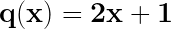
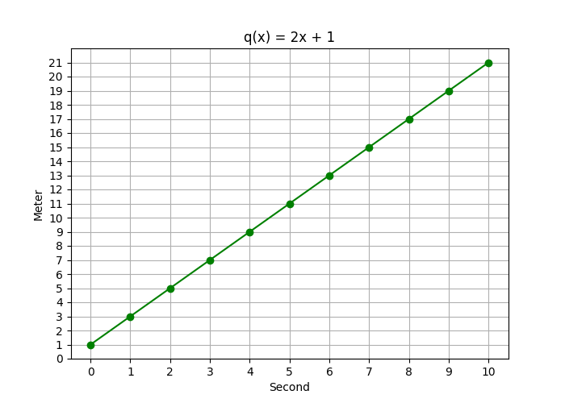
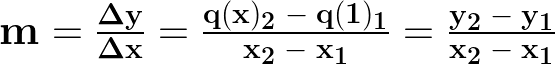
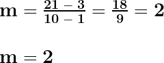

# Calculus

## Contents

 - [**Rate of Change**](#intro-to-rate-of-change)
   - [Linear Rate of Change](#linear-rate-of-change)
 - [**Limit**](#intro-to-limit)
 - [**Derivative**](#intro-to-derivative)
 - [**Integral**](#intro-to-integral)
 - [**Settings**](#settings)
 - [**REFERENCES**](#ref)
<!---
[WHITESPACE RULES]
- Same topic = "10" Whitespace character.
- Different topic = "50" Whitespace character.
--->


<!--- ( Rate of Change ) --->

---

<div id="intro-to-rate-of-change"></div>

## Rate of Change

The **Rate of Change** indicates:

 - **The *speed (velocity)** and *direction* of change of a *dependent variable (y)*.**
   - **PT-BR:** A rapidez (velocidade) e a direção da mudança de uma variável dependente (y).
- **In relation to the variation of the *independent variable (𝑥)*.**
  - **PT-BR:** Em relação à variação da variável independente (𝑥).

For example:

 - **Population Growth (Crescimento):**
   - 𝑦: Population of a city
   - x: Time (years)
   - *Interpretation:* The population of a *city (dependent)* changes over *time (independent)*.
 - **Distance Traveled:**
   - 𝑦: Distance traveled by a car.
   - x: Travel time.
   - *Interpretation:* The distance *traveled (dependent)* is determined by how long the car has been *moving (independent)*.

> **NOTE:**  
> In **Linear Functions**, this *rate* is *constant*, while in **Non-Linear Functions**, it can vary depending on the value of 𝑥.


---

<div id="linear-rate-of-change"></div>

## Linear Rate of Change

To understand the **"Linear Rate of Change"**, let's start with the *q(x) function*, which returns:

 - The number of **meters (dependent variable y)** traveled by a cyclist.
 - Based on the number of **seconds (independent variable x)** the cyclist rode (pedalou/andou) the bike.

**Imagine that the function is this:**  
  
<!---
\mathbf{q(x) = 2x + 1}
--->


<details>
<summary>Python Code</summary>

[meters_travelled_by_cyclist.py](src/meters_travelled_by_cyclist.py)
```python
from matplotlib import pyplot as plt
import numpy as np

def q(x):
    return 2 * x + 1

if __name__ =='__main__':
    x = np.array(range(0, 10+1))

    plt.figure(figsize=(7, 5))  # Width, Height.
    plt.plot(x, q(x), color='green', marker='o')
    plt.title("q(x) = 2x + 1")
    plt.xlabel('Second')
    plt.ylabel('Meter')
    plt.xticks(range(0, 10+1, 1))
    plt.yticks(range(0, 21+1, 1))
    plt.grid()
    plt.savefig("../images/rate-of-change-01.png")
    plt.show()
```

</details>

  

Looking at the graph above, we can see:

 - **How many *seconds (independent variable x)* the cyclist traveled:**
   - 10 seconds.
 - **How many *meters (dependent variable y)* the traveled per second:**
   - 1 second  = 3 meters.
   - 2 seconds = 5 meters.
   - 3 seconds = 7 meters.
   - 4 seconds = 9 meters.
   - 5 seconds = 11 meters.
   - 6 seconds = 13 meters.
   - 7 seconds = 15 meters.
   - 8 seconds = 17 meters.
   - 9 seconds = 19 meters.
   - 10 seconds = 21 meters.


> - If we pay close attention (Se prestarmos bastante atenção), we can see how much it changes every second it travels, which is `2 meters per second`.  
> - **NOTE:** This is because our function is linear (constant) and the variation (y<sub>1</sub> to y<sub>2</sub>) is the same (constant) from one value of x to another.  

Looking at this graph is easy, but we have a formula to solve this for any linear function:

  
<!---
\mathbf{m = \frac{\Delta y}{\Delta x} = \frac{q(x)_{2} \ - \ q(1)_{1}}{x_{2} \ - \ x_{1}} = \frac{y_{2} \ - \ y_{1}}{x_{2} \ - \ x_{1}}}
--->


Therefore (Portanto), we only need two ordered pairs of values ​**​x** and **y** to apply in the equation:

 - **After 1 second:**
   - *"x"* is *"1"*.
   - *"y"* is *"3"*.
 - **After 10 seconds:**
   - *"x"* is *"10"*.
   - *"y"* is *"21"*.

  
<!---
\\\mathbf{m = \frac{21 \ - \ 3}{10 \ - \ 1} = \frac{18}{9} = 2}
\\
\\\mathbf{ m = 2}
--->

> **But what does this "2" actually mean?**  
> It means that the cyclist is traveling `2 meters per second`.


<!--- ( Limit ) --->
<!--- ( Derivative ) --->
<!--- ( Integral ) --->


<!--- ( Settings ) --->

---

<div id="settings"></div>

## Settings

**CREATE VIRTUAL ENVIRONMENT:**  
```bash
python -m venv environment
```

**ACTIVATE THE VIRTUAL ENVIRONMENT (LINUX):**  
```bash
source environment/bin/activate
```

**ACTIVATE THE VIRTUAL ENVIRONMENT (WINDOWS):**  
```bash
source environment/Scripts/activate
```

**UPDATE PIP:**
```bash
python -m pip install --upgrade pip
```

**INSTALL PYTHON DEPENDENCIES:**  
```bash
pip install -U -v --require-virtualenv -r requirements.txt
```

**Now, Be Happy!!!** 😬


<!--- ( REFERENCES ) --->

---

<div id="ref"></div>

## REFERENCES

 - **General:**
   - [Help Engenharia](https://helpengenharia.com/)
 - **Limit:**
 - **Derivative:**
 - **Integral:**

---

**Rodrigo** **L**eite da **S**ilva - **drigols**
