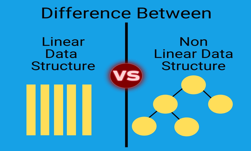

# Linear Data Structures

## Contents

 - [Intro to Linear Data Structures](#intro)
 - [Difference between Linear and Non-linear Data Structures](#linear-vs-non-linear)

---

## Intro to Linear Data Structures

 - A Linear Data Structure have data elements arranged in sequential manner;
 - Each member element is connected to its *previous* and *next* element;
 - This connection helps to traverse a Linear Data Structure in:
   - A single level;
   - and in single run.
 - Such (essas) Linear Data Structures are easy to implement as computer memory is also sequential.

**NOTE:**  
Examples of Linear Data Structures are:

 - Array;
 - Matrix;
 - List (Linked-List);
 - Stack
 - Queue

---

## Difference between Linear and Non-linear Data Structures

  

Following are the important differences between **Linear Data Structures** and **Non-linear Data Structures**:

| Key                           | Linear Data Structures | Non-linear Data Structures |
|-------------------------------|------------------------|----------------------------|
| **Data Element Arrangement**  | In Linear Data Structure, data elements are sequentially connected and each element is traversable through a single run. | In Non-Linear Data Structure, data elements are hierarchically connected and are present at various levels. |
| **Levels**                    | In Linear Data Structure, all data elements are present at a single level. | In Non-Linear Data Structure, data elements are present at multiple levels. |
| **Implementation Complexity** | Linear Data Structures are easier to implement. | Non-Linear Data Structures are difficult to understand and implement as compared to Linear Data Structures. |
| **Traversal**                 | Linear Data Structures can be traversed completely in a single run. | Non-Linear Data Structures are not easy to traverse and needs multiple runs to be traversed completely. |
| **Memory Utilization**        | Linear Data Structures are not very memory friendly and are not utilizing memory efficiently. | Non-Linear Data Structures uses memory very efficiently. |
| **Time Complexity**           | The *time complexity* of Linear Data Structure often increases when data increase in size. | The time complexity of Non-Linear data Structure `often remains (geralmente permanece)` when data increase in size. |
| **Examples**                  | Array, Matrix, List (Linked-List), Stack, Queue. | Graph, Tree, Map |

---

**REFERENCES:**  
[Difference between Linear and Non-linear Data Structures](https://www.tutorialspoint.com/difference-between-linear-and-non-linear-data-structures)  

---

Ro**drigo** **L**eite da **S**ilva - **drigols**
