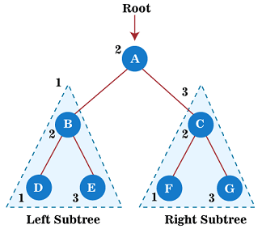
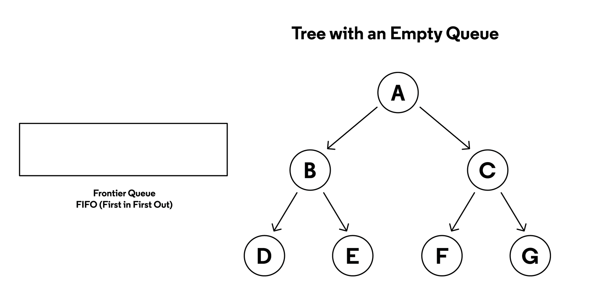
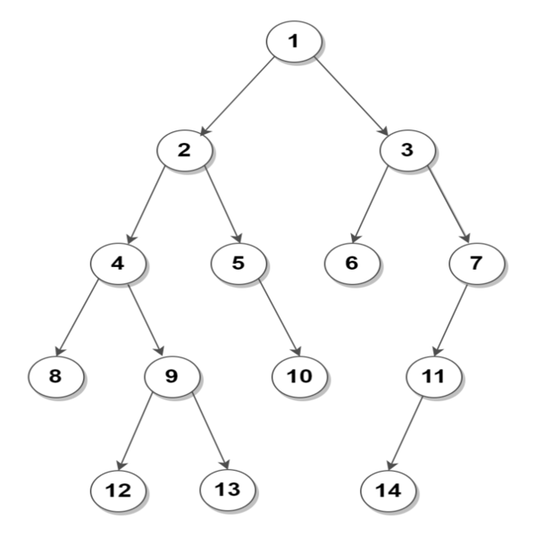
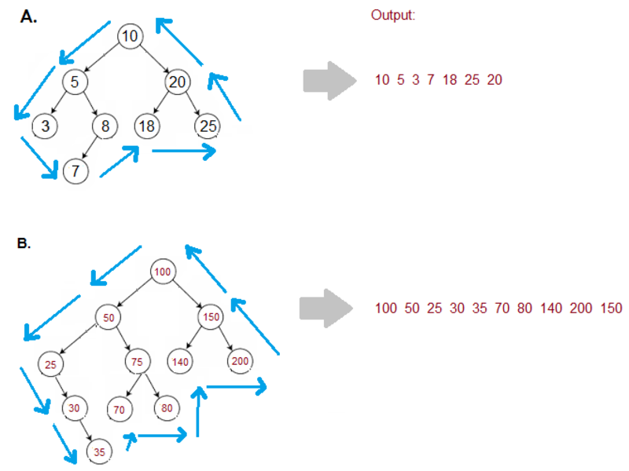
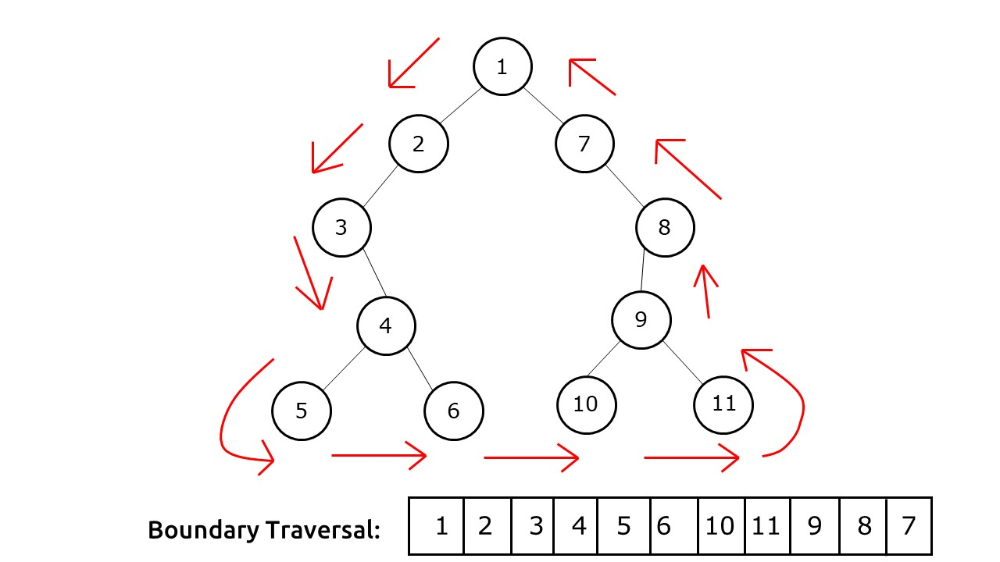
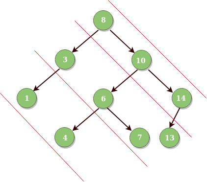

# Trees

## Contents

 - [**Tree Traversal Techniques**](#ttt)
   - [**Depth First Search (DFS):**](#depth-first-search)
     - [Inorder Traversal (LEFT->ROOT->RIGHT)](#inorder-traversal)
     - [Preorder Traversal (ROOT->LEFT->RIGHT)](#preorder-traversal)
     - [Postorder Traversal (LEFT->RIGHT->ROOT)](#postorder-traversal)
   - [**Level Order Traversal or Breadth First Search (BFS)**](#bfs)
   - [**Boundary Traversal**](#boundary-traversal)
   - [**Diagonal Traversal**](#diagonal-traversal)
 - [**References**](#ref)

<!--- ( Tree Traversal Techniques ) --->

---

<div id="ttt"></div>

## Tree Traversal Techniques

> Unlike **Linear Data Structures (Array, Vectors, Linked Lists, Queues, Stacks)** which have only one logical way to traverse them, trees can be traversed in different ways.

 - **1. - Depth First Search (DFS):**
   - Inorder Traversal (LEFT->ROOT->RIGHT)
   - Preorder Traversal (ROOT->LEFT->RIGHT)
   - Postorder Traversal (LEFT->RIGHT->ROOT)
 - **2. - Level Order Traversal or Breadth First Search (BFS)**
 - **3. - Boundary Traversal**
 - **4. - Diagonal Traversal**

---

<div id="depth-first-search"></div>

## Depth First Search (DFS)

> **Depth-First Search (DFS)** is an algorithm used for *searching* or *traversing* **tree** or **graph** data structures.

Has two approaches to implementing the Depth First Search (DFS) Algorithm:

 - **Iterative Implementation:**
   - The iterative approach uses a **Stack (Last In, First Out (LIFO))** to store the visited Nodes.
   - *Stack* also is used to maintain (manter) control of the tree traversal process.
   - The *stack* also is used to store the nodes that still need to be processed.
   - The use of the *stack* in the iterative approach allows for a non-recursive tree traversal and is particularly useful in situations where recursion can lead (levar) to a *stack overflow* in **very large** or **deep trees**.
   - Additionally, the iterative approach can be more efficient in terms of resource consumption compared to the recursive approach in certain cases.
 - **Recursive Implementation:**
   - The recursive approach does not explicitly rely (depende) on a stack for tree traversal since (pois) *the stack is implicitly managed by the programming language's* **call stack**.


---

<div id="inorder-traversal"></div>

## Inorder Traversal (LEFT->ROOT->RIGHT)

> This technique follows the **'LEFT->ROOT->RIGHT'** policy.

 - It means that first *left subtree is visited*.
 - After, the *root node is traversed*.
 - And finally, the *right subtree is traversed*.

> **NOTE:**  
> As the **root node** is traversed between the *left* and *right subtree*, it is named **inorder traversal**.

Until all nodes of the tree are not visited:

  - **Step 1 -** Traverse the *left subtree* recursively.
  - **Step 2 -** Visit the *root node*.
  - **Step 3 -** Traverse the *right subtree* recursively.

Now, let's see the example of the **Inorder traversal** technique:

  

Now, start applying the **inorder traversal** on the above tree:

 - First, we traverse the *left subtree B* that will be traversed in inorder.
 - After that, we will traverse the *root node A*.
 - And finally, the *right subtree C* is traversed in inorder.

```md
D->B->E->A->F->C->G
```

 - **Time Complexity:**
   - The *time complexity* of tree traversal techniques discussed above is **O(n)**, where **'n'** is the size of binary tree.
 - **Space Complexity:**
   - Whereas (considerando) the *space complexity* of tree traversal techniques discussed above is **O(1)** if we do not consider the stack size for function calls.
   - Otherwise (Caso contrário), the *space complexity* of this technique is **O(h)**, where **'h'** is the tree **height**.

---

<div id="preorder-traversal"></div>

## Preorder Traversal (ROOT->LEFT->RIGHT)

> This technique follows the **'ROOT->LEFT->RIGHT'** policy.

 - It means that, *first root node* is visited.
 - After that the *left subtree* is traversed recursively.
 - And finally, *right subtree* is recursively traversed.

**NOTE:**  
> - As the *root node* is traversed **before (or pre)** the left and right subtree, it is called **preorder traversal**.
> - So, in a **preorder traversal**, each *node* is visited before both of its *subtrees*.

Until all nodes of the tree are not visited:

 - **Step 1 -** Visit the *root node*.
 - **Step 2 -** Traverse the *left subtree* recursively.
 - **Step 3 -** Traverse the *right subtree* recursively.

Now, let's see the example of the **preorder traversal** technique:

  

Now, start applying the **preorder traversal** on the above tree:

 - First, we traverse the *root node A*.
 - After that, move to its left *subtree*, which will also be *traversed in preorder*.
 - And finally, the *right subtree C* is *traversed in preorder*.

```md
A->B->D->E->C->F->G
```

 - **Time Complexity:**
   - The *time complexity* of tree traversal techniques discussed above is **O(n)**, where **'n'** is the size of binary tree.
 - **Space Complexity:**
   - Whereas (considerando) the *space complexity* of tree traversal techniques discussed above is **O(1)** if we do not consider the stack size for function calls.
   - Otherwise (Caso contrário), the *space complexity* of this technique is **O(h)**, where **'h'** is the tree **height**.

---

<div id="postorder-traversal"></div>

## Postorder Traversal (LEFT->RIGHT->ROOT)

> This technique follows the **'LEFT->RIGHT->ROOT'** policy.

 - It means that the first *left subtree* of the *root node is traversed*.
 - After that recursively traverses the *right subtree*.
 - And finally, the *root node* is traversed.

> **NOTE:**  
> As the root node is traversed **after (or post)** the *left* and *right subtree*, it is called **postorder traversal**.

Until all nodes of the tree are not visited:

 - **Step 1 -** Traverse the *left subtree* recursively.
 - **Step 2 -** Traverse the *right subtree* recursively.
 - **Step 3 -** Visit the *root node*.

Now, let's see the example of the **postorder traversal** technique:

  

Now, start applying the **preorder traversal** on the above tree:

 - First, we traverse the *left subtree B* that will be *traversed in postorder*.
 - After that, we will traverse the *right subtree C in postorder*.
 - And finally, the *root node* of the above tree, i.e., A, is traversed.

```md
D->E->B->F->G->C->A
```

 - **Time Complexity:**
   - The *time complexity* of tree traversal techniques discussed above is **O(n)**, where **'n'** is the size of binary tree.
 - **Space Complexity:**
   - Whereas (considerando) the *space complexity* of tree traversal techniques discussed above is **O(1)** if we do not consider the stack size for function calls.
   - Otherwise (Caso contrário), the *space complexity* of this technique is **O(h)**, where **'h'** is the tree **height**.

---

<div id="bfs"></div>

## Level Order Traversal or Breadth First Search (BFS)

> **Level Order Traversal or Breadth First Search (BFS)** is when you inspect every node on a level starting at the top of the tree and then move to the *next level*.

For example, see the image below to understand more easily:

  

**NOTE:**  
The **Level Order Traversal or Breadth First Search (BFS)** use the **Queue (First In First Out - FIFO)** approach to store and manage the Nodes:

  

---

<div id="boundary-traversal"></div>

## Boundary Traversal

> A **Boundary Traversal** uses an **Anti-Clockwise** direction to traverse or search Trees or Graphs.

For example, see the image below to understand more easily:

  

Following the **"Boundary Traversal"** approach:

 - First, we need to visit the *"root node"*.
 - Next, we visit the *"Left Boundary Nodes"*.
 - Next, we visit the *"Leaf Nodes"*.
 - And finally, we visit the *"Right Boundary Nodes"*.

Following this order, we have the following output (result):

  

```md
1->2->4->8->12->13->10->6->14->11->7->3
```

> **And the internal *9* and *5* nodes?**

 - In the **Boundary Traversal** algorithm, the internal nodes on the right side are omitted because the traversal aims (visa) to visit only the nodes that lie (que estão) on the outer boundary (limites externos) of a binary tree, including:
   - The *root node*.
   - *Left boundary nodes*.
   - And *right boundary nodes*.
 - In the typical implementation of this algorithm, the internal nodes on the right side are omitted because the traversal focuses on the outer boundary (limites externos) of the tree:
   - This means that only the nodes that are closest (próximos) to the edge (borda) of the tree are considered, while the internal nodes are ignored.

See the other **Boundary Traversal** images (examples) below:

  
  
  

> **NOTE:**  
> Remember that **Boundary Traversal** uses an **Anti-Clockwise** direction.

---

<div id="diagonal-traversal"></div>

## Diagonal Traversal

To understand **Diagonal Traversal** first see the image below:

  

To *traverse (or search)* using the **Diagonal Traversal** approach we:

 - The first *node* to visit is the *root node*.
 - From the *root node* go to the *right node* following the slope (-1):
   - root and *root->right* values will be prioritized over all *root->left* values.
 - Follow the same process to the other lines.

The output (traversal and search) to the tree shown is:

```
8->10->14->3->6->7->13->1->4
```


<!--- ( REFERENCES ) --->

---

<div id="ref"></div>

## References

 - [Depth-First Search: Conceptual](https://www.codecademy.com/article/depth-first-search-conceptual)
 - [Depth-first search - wikipedia](https://en.wikipedia.org/wiki/Depth-first_search)
 - [Learn Depth-First Search(DFS) Algorithm From Scratch](https://www.simplilearn.com/tutorials/data-structure-tutorial/dfs-algorithm)
 - [Tree traversal (Inorder, Preorder an Postorder)](https://www.javatpoint.com/tree-traversal)
 - [Tree Traversal: Breadth-First Search vs Depth-First Search](https://www.codecademy.com/article/tree-traversal)
 - [Boundary Traversal of Binary Tree](https://www.codingninjas.com/studio/problems/boundary-traversal_790725)
 - [Perform boundary traversal on a binary tree](https://www.techiedelight.com/boundary-traversal-binary-tree/)
 - [Boundary Traversal of a Binary Tree](https://takeuforward.org/data-structure/boundary-traversal-of-a-binary-tree/)
 - [Diagonal Traversal of Binary Tree](https://www.geeksforgeeks.org/diagonal-traversal-of-binary-tree/)

---

Ro**drigo** **L**eite da **S**ilva - **drigols**
