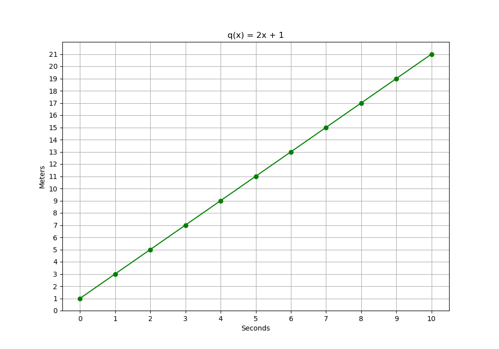
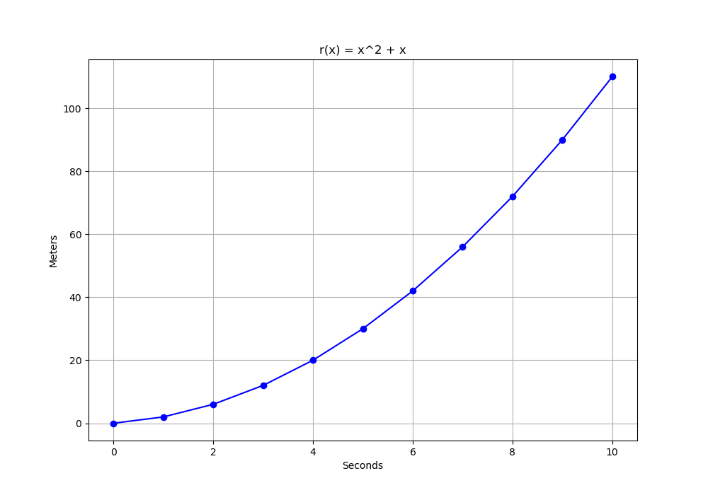
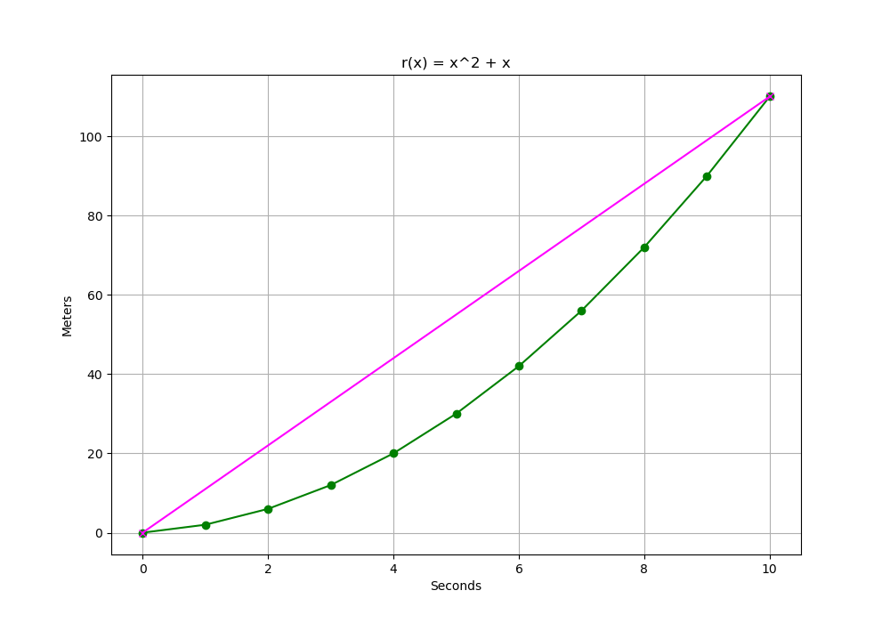
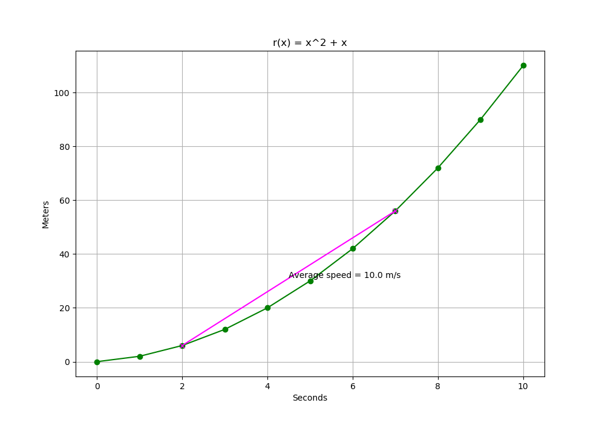

# Taxa de Variação

## Contents

 - [01 - Taxa Linear de Mudança](#01)
 - [02 - Taxa Média de Mudança](#02)

<div id='01'></div>

## 01 - Taxa Linear de Mudança

Por exemplo, imagine uma função **(q)** que retorne o número de metros percorridos por um ciclista com base no número de segundos que o ciclista andou de bicicleta.

Vamos imaginar que a função é essa:

  

Como a gente é da turma do Python, vamos criar uma função para resolver isso supondo que o nosso ciclista percorreu por 10 segundos apenas:

[meters_travelled_by_cyclist.py](src/meters_travelled_by_cyclist.py)
```python
def q(x):
  return 2 * x + 1

if __name__ =='__main__':
  from matplotlib import pyplot as plt
  import numpy as np

  x = np.array(range(0, 10+1))

  plt.figure(figsize=(10, 7))
  plt.plot(x, q(x), color='green', marker='o')
  plt.title("q(x) = 2x + 1")
  plt.xlabel('Seconds')
  plt.ylabel('Meters')
  plt.xticks(range(0, 10+1, 1))
  plt.yticks(range(0, 21+1, 1))
  plt.grid()
  plt.savefig("../images/plot-01.png", format='png')
  plt.show()
```

**OUTPUT:**  
  

**NOTE:**  
Fica claro no gráfico que ***q(x)*** é uma função linear que descreve uma inclinação na qual a distância aumenta a uma taxa constante ao longo do tempo. Em outras palavras, o ciclista está viajando a uma velocidade constante.

**Mas que velocidade?**  

> A velocidade é uma medida de mudança - mede como a distância percorrida muda ao longo do tempo (é por isso que normalmente a expressamos como uma unidade de distância por unidade de tempo, como milhas por hora ou metros por segundo).

Então, estamos procurando uma maneira de medir a mudança na linha criada pela função. A mudança de valores ao longo da linha define sua **inclinação (slope/gradient)**.

Sabemos que uma **inclinação (slope/gradient)** pode ser representada da seguinte maneira:

  

Sabendo disso podemos calcular a inclinação de nossa função assim:

  

Portanto, precisamos apenas de dois pares ordenados de valores **x** e **q(x)** da nossa linha para aplicar esta equação.

 - Após 1 segundo:
   - **x** é **1**;
   - E **q(1)** é **3**.
 - Após 10 segundos:
   - **x** é 10;
   - E **q(10)** é **21**.

Assim, podemos medir a taxa de mudança assim:

  

É o mesmo que:

  

O que simplifica para:

  

Portanto, a nossa taxa de mudança é  `2/1` ou dito de outra forma - **O ciclista está viajando a 2 metros por segundo**.

<div id='02'></div>

## 02 - Taxa Média de Mudança

Ok, agora vamos ver outra função que calcula a distância percorrida por um determinado número de segundos percorridos por um ciclista:

  

Vamos dar uma olhada nisso usando Python:

[meters_travelled_by_cyclist-v2.py](src/meters_travelled_by_cyclist-v2.py)
```python
def r(x):
  return x**2 + x

if __name__ =='__main__':
  from matplotlib import pyplot as plt
  import numpy as np

  x = np.array(range(0, 10+1))

  plt.figure(figsize=(10, 7))
  plt.plot(x, r(x), color='blue', marker='o')
  plt.title("r(x) = x^2 + x")
  plt.xlabel('Seconds')
  plt.ylabel('Meters')
  plt.grid()
  plt.savefig("../images/plot-02.png", format='png')
  plt.show()
```

**OUTPUT:**  
  

**NOTE:**  
**Desta vez, a *função não é linear.***  
Na verdade, é uma **função quadrática**, e a linha de **0** a **10** segundos mostra um aumento exponencial; em outras palavras, o ciclista está *acelerando*.

**NOTE:**  
> Precisamos definir uma linha *secante* que **une dois pontos em nosso arco exponencial** para criar uma inclinação reta.

Por exemplo, uma linha secante por todo o período de **10** segundos uniria os dois pontos a seguir:

 - 0, r(0)
 - 10, r(10)

Vamos ver isso em Python para ficar mais claro:

[meters_travelled_by_cyclist_secant.py](src/meters_travelled_by_cyclist_secant.py)
```python
def r(x):
  return (x)**2 + x

if __name__ =='__main__':
  from matplotlib import pyplot as plt
  import numpy as np

  x = np.array(range(0, 10+1))

  # Secant representation.
  s = np.array([0, 10])

  plt.figure(figsize=(10, 7))
  plt.plot(x, r(x), color='green', marker='o')
  plt.plot(s, r(s), color='magenta', marker='x') # Add secant line.
  plt.title("r(x) = x^2 + x")
  plt.xlabel('Seconds')
  plt.ylabel('Meters')
  plt.grid()
  plt.savefig("../images/plot-03.png", format='png')
  plt.show()
```

**OUTPUT:**  
  

Agora, como a **linha secante** é **reta**, podemos aplicar a fórmula da **inclinação (slope/gradient)** que usamos para uma função linear para calcular a velocidade média **para o período de 10 (se passa de 10 segundo a inclinação talvez já seja outra) segundos em uma função exponencial**:

 - Em **0** segundos, **x** é **0** e **r(0) = 0**;
 - Em **10** segundos, **x** é **10** e **r(10) = 110**.

Assim, podemos medir a taxa de mudança assim:

  

É o mesmo que:

  

O que simplifica para:

  

Portanto, a nossa taxa de mudança é `11/1` ou dito de outra forma - **O ciclista está viajando a uma velocidade média de 11 metros por segundo ao longo do período de 10 segundos**.

**NOTE:**  
> Obviamente, podemos medir a velocidade média entre dois pontos na linha exponencial.

Sabendo disto agora vamos:
 - Mostrar a linha secante para o período entre 2 e 7 segundos;
 - E calcule a velocidade média para esse período.

[meters_travelled_by_cyclist-v3.py](src/meters_travelled_by_cyclist-v3.py)
```python
def r(x):
  return (x)**2 + x

if __name__ =='__main__':
  from matplotlib import pyplot as plt
  import numpy as np

  x = np.array(range(0, 10+1))

  # Secant representation - 2 to 7.
  s = np.array([2, 7])

  # Slope/Gradient calculus.
  x1 = s[0]
  y1 = r(x1)
  x2 = s[-1]
  y2 = r(x2)
  slope = (y2 - y1)/(x2 - x1)

  plt.figure(figsize=(10, 7))
  plt.plot(x, r(x), color='green', marker='o')
  plt.plot(s, r(s), color='magenta', marker='x') # Add secant line.
  plt.annotate('Average speed = ' + str(slope) + ' m/s',((x2 + x1)/2, (y2 + y1)/2)) # Add notation.
  plt.title("r(x) = x^2 + x")
  plt.xlabel('Seconds')
  plt.ylabel('Meters')
  plt.grid()
  plt.savefig("../images/plot-04.png", format='png')
  plt.show()
```

**OUTPUT:**  
  

---

**REFERENCES:**  
[Essential Mathematics for Artificial Intelligence](https://courses.edx.org/courses/course-v1:Microsoft+DAT256x+1T2018a/course/)  

---

***Rodrigo Leite*** *- Software Engineer*
