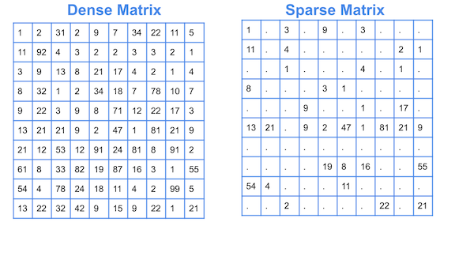
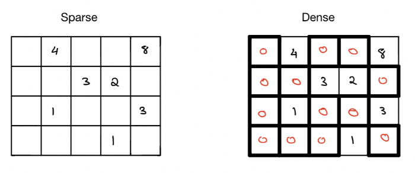

# Matrizes Esparsas

## Conteúdo

 - [01 - Introdução às Matrizes Esparsas](#intro)
 - [02 - Como uma Matriz Esparsa é armazenada? (Com SciPy no nosso caso)](#scipy)
 - [03 - Quantificando a esparsidade de uma Matriz](#sparsity)
 - [04 - Matrizes Esparsas em Machine Learning](#sparse-matrices-ml)
   - [04.1 - Por que utilizar Matrizes Esparsas em Machine Learning?](#why-sparse-matrices)
 - **05 - Matrizes Esparsas com SciPy:**
   - [05.1 - Criando uma Matriz densa](#dense-matrix)
   - [05.2 - Convertendo uma Matriz Densa em Sparsa & vice-versa](#vice-versa)
   - [05.3 - Calculando (Quantificando) a esparsidade de uma Matriz na prática com Python](#sparsity-python)
   - [05.4 - Concatenando Matrizes Esparsas com SciPy vstack & hstack](#vstack-hstack)
   - [05.5 - Salvando e dando load em Matrizes Esparsas](#save-load)

---

<div id="intro"></div>

## 01 - Introdução às Matrizes Esparsas

> **Matrizes** que contêm principalmente valores zero são chamadas **esparsas**, distintas das matrizes onde a maioria dos valores são diferentes de zero, chamadas **densas**.

**NOTE:**  
**Matrizes Esparsas** são mais **eficientes** porque os valores **0 (zero) são removidos**, enquanto as matrizes densas mantêm o 0 (zero).

Por exemplo, vejam as imagens abaixo para ficar mais claro:

  
  

---

<div id="scipy"></div>

## 02 - Como uma Matriz Esparsa é armazenada? (Com SciPy no nosso caso)

> Ok, agora vem a **pergunta-chave**. Como essa Matriz Esparsa é armazenada visto que os zeros são descartados?.

Para o nosso exemplo, vamos utilizar a mesma lógica da biblioteca [SciPy](https://scipy.org/). Veja a imagem abaixo:

  

**NOTE:**  
 - Vejam, que cada elemento (diferente de zero) é armazenado em uma matriz bidimensional, onde, cada elemento é mapeado por sua, respectiva, linha e coluna.
 - Outra observação crucial aqui é que a primeira linha (de cor vermelha) nós diz as dimensões e número de elementos (diferentes de zero) da Matriz Esparsa:
   - 4 Linhas;
   - 5 Colunas;
   - 7 Elementos (diferentes de zero).

**NOTE:**  
Com essas informações bem mapeadas fica fácil converter uma Matriz Esparsa de volta para densa e vice-versa.

---

<div id="sparsity"></div>

## 03 - Quantificando a esparsidade de uma Matriz

> A **esparsidade** de uma matriz pode ser quantificada com uma pontuação, que é o número de valores zero na matriz dividido pelo número total de elementos na matriz.

Algo parecido com isso:

```python
sparsity = count zero elements / total elements
```

Por exemplo, vamos quantificar esparsidade da Matriz abaixo:

```python
     1, 0, 0, 1, 0, 0
A = (0, 0, 2, 0, 0, 1)
     0, 0, 0, 2, 0, 0
```

**NOTE:**  
O exemplo tem 13 valores zero dos 18 elementos na matriz, dando a esta matriz uma esparsidade de **0,722** ou cerca de **72% esparsa**.

---

<div id="sparse-matrices-ml"></div>

## 04 - Matrizes Esparsas em Machine Learning

> **Matrizes Esparsas** aparecem muito em problemas de **Inteligência Artificial (Machine Learning & Deep Learning)**.

**NOTE:**  
**Matrizes esparsas** surgem em alguns tipos específicos de dados, principalmente observações que **registram a ocorrência** ou **contagem de uma atividade**.

Por exemplo:

 - Quantas vezes cada palavra (ou caractere) aparecem em um texto;
 - Se um usuário assistiu ou não a um filme em um catálogo de filmes;
 - Se um usuário comprou ou não um produto em um catálogo de produtos;
 - Contagem do número de escutas de uma música em um catálogo de músicas.

---

<div id="why-sparse-matrices"></div>

## 04.1 - Por que utilizar Matrizes Esparsas em Machine Learning?

> Os usuários do [sklearn](https://scikit-learn.org/stable/) notarão que todos os algoritmos nativos de **Machine Learning** exigem que as matrizes de dados estejam na memória.

**NOTE:**  
Dito de outra forma, o processo de Machine Learning é interrompido quando uma matriz de dados **(geralmente chamada de dataframe)** não se encaixa na **RAM**. Uma das vantagens de converter uma matriz de dados densa para esparsa é que, em muitos casos, é possível comprimi-la para caber na RAM.

**NOTE:**  
Geralmente para uma matriz típica **m x n**, a quantidade de memória para armazenar essa matriz seria proporcional às dimensões da matriz, porém para matrizes esparsas, como estamos armazenando apenas valores diferentes de zero, a memória resultante é reduzida. A frequência de entradas diferentes de zero na matriz também terá um impacto na economia de memória e tempo.

---

<div id="dense-matrix"></div>

## 05.1 - Criando uma Matriz Densa

De início, vamos começar criando uma matriz densa com **NumPy**:

[dense_matrix.py](src/dense_matrix.py)
```python
from numpy import array

dense_matrix = array(
  [
    [1, 0, 0, 1, 0, 0],
    [0, 0, 2, 0, 0, 1],
    [0, 0, 0, 2, 0, 0]
  ]
)

print("Dense Matrix:\n", dense_matrix)
```

**OUTPUT:**  
```python
Dense Matrix:
 [[1 0 0 1 0 0]
 [0 0 2 0 0 1]
 [0 0 0 2 0 0]]
```

**Ué, Mas essa Matriz tem mais valores 0 (zeros) do que não, ela não é esparsa?**  
Não! Na teoria ela já pode ser convertida para uma *Matriz Esparsa*, mas ainda não é uma. Isso, porque uma *Matriz Densa* mantem os valores 0 (zeros).

> **Ok, Mas como eu posso converter essa *Matriz Densa* em uma *Matriz Esparsa*?**

---

<div id="vice-versa"></div>

## 05.2 - Convertendo uma Matriz Densa em Sparsa & vice-versa

Agora sim, nós vamos converter uma *Matriz Densa* em *Esparsa* com o método **csr_matrix()** do **SciPy** e depois converter de volta para Densa com o método **todense()**.

 - **csr_matrix():**
   - Converter uma *Matriz Densa* em *Esparsa*.
 - **todense():**
   - Converter uma *Matriz Esparsa* em *Densa*.

Vamos ver na prática como isso funciona:

[dense_sparse_viceversa.py](src/dense_sparse_viceversa.py)
```python
from scipy.sparse import csr_matrix
from numpy import array

# Create dense matrix
dense_matrix = array(
  [
    [1, 0, 0, 1, 0, 0],
    [0, 0, 2, 0, 0, 1],
    [0, 0, 0, 2, 0, 0]
  ]
)

# Convert to sparse matrix (CSR method)
sparse_matrix = csr_matrix(dense_matrix)
print("Sparse Matrix:\n", sparse_matrix)
print("Sparse Matrix shape:", sparse_matrix.shape)

# Reconstruct dense matrix
dense_matrix_two = sparse_matrix.todense()
print("\nDense Matrix:\n", dense_matrix_two)
print("Dense Matrix shape:\n", dense_matrix_two.shape)
```

**OUTPUT:**  
```python
Sparse Matrix:
   (0, 0)       1
  (0, 3)        1
  (1, 2)        2
  (1, 5)        1
  (2, 3)        2
Sparse Matrix shape: (3, 6)

Dense Matrix:
 [[1 0 0 1 0 0]
 [0 0 2 0 0 1]
 [0 0 0 2 0 0]]
Dense Matrix shape:
 (3, 6)
```

**NOTE:**  
Vejam que a **Matriz Esparsa** tem o mapeamento de cada elemento da Matriz e para saber as dimensões das matrizes nós utilizamos o atributo **shape**.

---

<div id="sparsity-python"></div>

## 05.3 - Calculando (Quantificando) a esparsidade de uma Matriz na prática com Python

Lembram que nós tinhamos como quantificar a esparsidade de uma Matriz?

Assim

```python
sparsity = count zero elements / total elements
```

Mas, como fazer isso na prática com Python? Simples...

[sparsity.py](src/sparsity.py)
```python
from scipy.sparse import csr_matrix
from numpy import count_nonzero
from numpy import array

# Create dense matrix
dense_matrix = array(
  [
    [1, 0, 0, 1, 0, 0],
    [0, 0, 2, 0, 0, 1],
    [0, 0, 0, 2, 0, 0]
  ]
)

# Convert to sparse matrix (CSR method)
sparse_matrix = csr_matrix(dense_matrix)
print("Sparse Matrix:\n", sparse_matrix)
print("Sparse Matrix shape:", sparse_matrix.shape)

# Reconstruct dense matrix
dense_matrix_two = sparse_matrix.todense()
print("\nDense Matrix:\n", dense_matrix_two)
print("Dense Matrix shape:\n", dense_matrix_two.shape)

# Calculate sparsity
sparsity = 1.0 - count_nonzero(dense_matrix) / dense_matrix.size
print("\nMatrix Sparsity", sparsity)
```

**OUTPUT:**  
```python
Sparse Matrix:
   (0, 0)       1
  (0, 3)        1
  (1, 2)        2
  (1, 5)        1
  (2, 3)        2
Sparse Matrix shape: (3, 6)

Dense Matrix:
 [[1 0 0 1 0 0]
 [0 0 2 0 0 1]
 [0 0 0 2 0 0]]
Dense Matrix shape:
 (3, 6)

Matrix Sparsity 0.7222222222222222
```

**NOTE:**  
 - O número de elementos **diferentes de zero** em um array NumPy pode ser dado pela função **count_nonzero()**;
 - Número **total (contendo elementos zeros também) de elementos** em um array NumPy pode ser dado pelo atributo **size**.
 - E por fim, podemos encontrar o número de elementos zeros em um array NumPy subtraindo 1 do número de elementos diferentes de zero: **(1.0 - count_nonzero(dense_matrix))**

---

<div id="vstack-hstack"></div>

## 05.4 - Concatenando Matrizes Esparsas com SciPy vstack & hstack

Para concatenar duas Matrizes Esparsas (ou mais) a biblioteca SciPy tem as seguintes funções:

 - **vstack:**
   - Concatena as matrizes esparsas verticalmente.
 - **hstack:**
   - Concatena as matrizes esparsas horizontalmente.

**Concatenando verticalmente com a função vstack():**  
```python
from scipy.sparse import coo_matrix, vstack
A = coo_matrix([[1, 2], [3, 4]])
B = coo_matrix([[5, 6]])
vstack([A, B]).toarray()
```

**OUTPUT:**  
```python
array([[1, 2],
       [3, 4],
       [5, 6]])
```

**Concatenando horizontalmente com a função hstack():**  
```python
from scipy.sparse import coo_matrix, hstack
A = coo_matrix([[1, 2], [3, 4]])
B = coo_matrix([[5], [6]])
hstack([A,B]).toarray()
```

**OUTPUT:**  
```python
array([[1, 2, 5],
       [3, 4, 6]])
```

**NOTE:**  
Vale salientar que para fazer esse processo de concatenação as duas funções **vstack** e **hstack** utilizam a *Estrutura de Dados* **Stack**.

---

<div id="save-load"></div>

## 05.5 - Salvando e dando load em Matrizes Esparsas

Para esse caso em específico eu não vou deixar nenhum exemplo prático. Vou deixar o link para a documentação oficial do SciPy com as funções específicas:

**scipy.sparse.save_npz:**  
https://docs.scipy.org/doc/scipy/reference/generated/scipy.sparse.save_npz.html

**numpy.savez_compressed:**  
https://numpy.org/devdocs/reference/generated/numpy.savez_compressed.html#numpy.savez_compressed

**scipy.sparse.load_npz:**  
https://docs.scipy.org/doc/scipy/reference/generated/scipy.sparse.load_npz.html#scipy.sparse.load_npz

---

**REFERÊNCIAS:**  
[A Gentle Introduction to Sparse Matrices for Machine Learning](https://machinelearningmastery.com/sparse-matrices-for-machine-learning/)  

---

**Rodrigo Leite -** *drigols*
