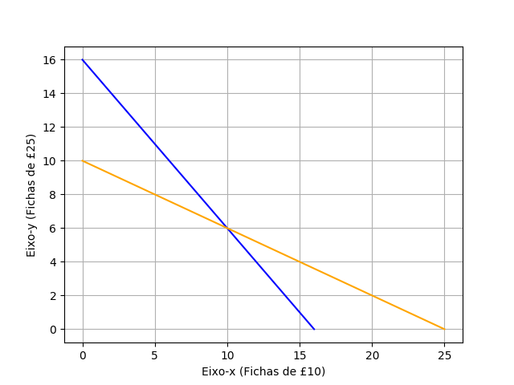

# Sistemas de Equações

# Contents

 - [01 - Introdução aos Sistemas de Equações](#01)
 - [02 - Plotando o Ponto de Interseção](#02)
 - [03 - Resolvendo um sistema de equações com eliminação](#03)

<div id='01'></div>

## 01 - Introdução aos Sistemas de Equações

Vamos começar aqui com o seguinte exemplo. Suponha que nós estamos de férias e resolvemos ir a Las Vegas joga um pouco nos cassinos (já que nós somos ricos isso não é problema né, rss).

Em determinado momento depois de jogar por várias horas nós estamos na seguinte situação no cassino:

 - **1ª -** Nós temos uma mistura de fichas de **£10** e de **£25**;
 - **2ª -** Entre essas misturas de fichas nós sabemos que `temos um total de 16 fichas`;
 - **3ª -** E por fim nós sabemos que no total `nós temos em valor £250 em fichas`.

Agora vem a questão:

> Essas informações são suficientes para determinar quantas de cada determinadas fichas você possui?

Bem, podemos expressar cada um dos fatos que temos como uma *equação*:

 - **A `Primeira Equação` lida com o número total de fichas: - Sabemos que isso é 16:**
   - Que são as fichas de `£10 (que chamaremos de x)`;
   - Adicionada as fichas de `£25 (chamaremós de y)`.

Então nossa primeira equação vai ter o seguinte formato:

  

 - **A `Segunda Equação` lida com o valor total de todas as fichas `(£250)`:**
   - Sabemos que isso é composto por **x** fichas no valor de `£10`;
   - E **y** fichas no valor de **£25**.

Então sabendo disto nós temos agora a segunda equação:

  

Em conjunto, essas equações formam um `sistema de equações` que nos permitirá determinar quantas de cada determinadas fichas temos.

  
  

<div id='02'></div>

## 02 - Plotando o Ponto de Interseção

Uma abordagem é determinar todos os valores possíveis para **x** e **y** em cada equação e plotá-los.

Uma coleção de **16** fichas poderia ser composta por:
 - 16 fichas de **£10** e nenhuma de £25 - `[16, 0]`
 - Ou nenhuma de `£10` e 16 fichas de `£25` - `[0, 16]`
 - Ou qualquer combinação entre elas...

Da mesma forma, um total de `£250` poderia ser composto por:
 - **25** fichas de `£10` e nenhuma de `£25` - Totalizando 250;
 - Ou nenhuma de `£10` e **10** de `£25` - Totalizando 250;
 - Ou uma combinação entre elas....

Vamos plotar cada um desses intervalos de valores como linhas em um gráfico:

[intersection_point.py](src/intersection_point.py)
```python
from matplotlib import pyplot as plt

# Uma coleção de 16 fichas poderia ser composta por:
chipsAll10s = [16, 0] # 16 fichas de £10 e nenhuma de £25.
chipsAll25s = [0, 16] # Ou nenhuma de £10 e 16 de £25.

# Da mesma forma, um total de £250 poderia ser composto por:
valueAll10s = [25, 0] # 25 fichas de £10 e nenhuma de £25 - Totalizando £250
valueAll25s = [0, 10] # Ou nenhuma de £10 e 10 de £25 - Totalizando £250;

plt.plot(chipsAll10s, chipsAll25s, color='blue')
plt.plot(valueAll10s, valueAll25s, color="orange")
plt.xlabel('Eixo-x (Fichas de £10)')
plt.ylabel('Eixo-y (Fichas de £25)')
plt.grid()
plt.savefig('../images/plot-01.png', format='png')
plt.show()
```

**OUTPUT:**  
  

Observando o gráfico, você pode ver que há apenas uma única combinação de:

 - Fichas de **£10** e **£25** que está na linha para todas as combinações possíveis de **16** fichas;
 - E na linha para todas as combinações possíveis de **£250**.
 
O ponto onde a linha se cruza é **(10, 6)**; Em outras palavras:
 - Existem dez fichas de **£10**;
 - E seis fichas de **£25**.

  

<div id='03'></div>

## 03 - Resolvendo um sistema de equações com eliminação

Você também pode resolver um sistema de equações matematicamente. Vamos dar uma olhada em nossas duas equações:

  
  

Podemos combinar as equações adicionando-as juntas, mas primeiro precisamos manipular uma das equações para que a adição delas elimine o termo **x**.

 - A primeira equação inclui o termo **x**;
 - E a segunda inclui o termo **10x**

Portanto, se multiplicarmos a primeira equação por **-10**, os dois termos **x** se cancelarão. Então, vamos fazer isso, multiplicar a primeira equação por **-10** e ver como fica:

  
  

Agora vamos juntar a nossa equação multiplicada por **-10** com a nossa segunda equação:

  
  

Agora vamos usar nosso raciocínio matemático de forma que uma das equações cancele os termos da outra. Vamos utilizar a primeira equação para cancelar a segunda, deixando-nos com uma única equação como esta:

  

Podemos isolar **y** dividindo os dois lados por 15:

  

Então agora temos um valor para **y**:

  

Então, como isso nos ajuda? Bem, agora temos um valor para **y** que `satisfaz as duas equações`. Podemos simplesmente usá-lo em qualquer uma das equações para determinar o valor de **x**. Vamos usar para a primeira equação que é mais simples (Aqui é Brasil né, rss):

  

Agora é muito simples, basta resolver essa equação e obtemos um valor para **x**:

  

Assim como fizemos com o método de `interseção gráfica`, da para saber que existem:

 - **10** fichas de **£10**;
 - E **6** fichas de **£25**;
 - Totalizando - **£250**.

Nós também podemos utilizar o Python para verificar se as equações são verdadeiras com um valor **x** de **10** e um valor **y** de **6**:

[test_intersection.py](src/test_intersection.py)
```python
x = 10
y = 6
print ((x + y == 16) & ((10*x) + (25*y) == 250))
```

**OUTPUT:**  
```
True
```

---

**Rodrigo Leite** *- Software Engineer*
