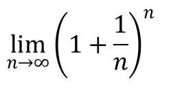
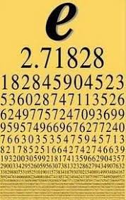

# O Número de Euler (e)

# Contents

 - [01 - O problema inicial (abstração)](#01)
 - [02 - O Número de Euler (e)](#02)

## 01 - O problema inicial (abstração)

O número de ***`Euler`*** diferente de outras constantes como **`√2`**, **`o número pi π`**, entre outros ele não veio da Geometria. Vamos criar um exemplo abstrado para você entender de onde veio esse número magnífico.

Imagine que um Banco vai te pagar uma taxa de 8% **`no final do ano (ou, ao ano)`** de rendimento em um valor qualquer `(M)` que você invista.

> Ou seja, você vai ter um valor **`M`** que vai render **`8% no final do ano (ou, ao ano)`**.

A fórmula ficaria a seguinte:

  

**NOTE:**  
Ou seja, nosso montante `M` vai receber ***1 + a taxa de juros*** (100% no nosso caso).

Agora suponha que seu banco ficou louco ou ele é muito generoso e vai te pagar 100% de rendimento *(oh my god)* **`no final do ano (ou, ao ano)`**, ou seja:

  

Muito bom né, seu investimento rendendo 100% ao ano! Agora suponha que seu banco está criando outros modelos de investimento e lhe fez a seguinte oferta:

 - **1ª -** Se você quer continuar recebendo 100% do seu investimento `(M)` **`no final do ano (ou, ao ano)`**;
 - **2ª -** Ou, ele vai te pagar:
   - Em 6 meses a metade desse juros, ou seja **100%/2**;
   - E depois vai multiplicar de novo pelo o valor que ficou ali até fechar o ano.

**What?** Bem, vai ser o seguinte. Na primeira proposta nós já sabemos que vai ser 100% do seu investimento no final do ano:

  

Na segunda proposta nós vamos receber na metade do ano (6 meses) `a metade dos 100%`; `E depois multiplicar essa metade até fechar o ano`. Não entendeu? Veja a fórmula a seguir para ficar mais claro:

  

Se você prestar atenção é como se nós tivessemos de escolher entre:

 - Receber o rendimento (juros) de 100% **`no final do ano (ou, ao ano)`**;
 - Ou, receber o rendimento (juros) em **`duas partes divididos e multiplicado`**.

> Isso pode depender também de quanto estamos investindo, já que as 2 equações são *linear* e *exponenciais* pode ser que dependendo do investimento uma seja maior e com outro investimento maior a outro que seja maior.

Mas vamos ignorar os investimentos só por agora e vamos ver qual compensaria apenas trabalhando com o que temos:

  

Opa, veja que a segunda opção **(M2)** deu um valor maior `2,25`, ou seja, é mais interessante receber pelo a metade do que os 100% de uma vez.

Agora suponha que o banco criou outro modelo de rendimento (juros). Ele está disposto a te pagar 100% ao mês, ou seja, **100%/12**. Será que compensa? Ou seja, nós temos:

100% **`no final do ano (ou, ao ano) - 1 única parte`**:

  

100% em 2 metades `- 100%/2`:

  

E agora nós temos 100% em 12 partes:

  

Vamos utilizar nossos conhecimentos potenciação para minimizar isso porque ninguém merece essa conta enorme:

  

Eita, já aumentou nosso rendimento (juros) hein - `2,61`. Agora suponha que o banco criou outro modelo e deseja pagar 100% porém agora ele que pagar por semana, será que compensa? Bem, como um ano tem aproximadamente 52 semanas vai ficar algo parecido com isso:

Esse banco é bom hein, quanto mais ele subdivide esse juros de 100% mais dá para ganhar em cima do banco.

## 02 - O Número de Euler (e)

Bem, se você prestar atenção nos nossos exemplos acima você verá que sempre aumenta um pouco, mas se pensamos até o infinito `(∞)` será que vai sempre aumentar esses valores?

Então, ai que entra [Johann Bernoulli](https://en.wikipedia.org/wiki/Johann_Bernoulli) que pensou, qual será o valor desta equação se eu elevar ao infinito, ou seja:

  

É ai que entra o gênio [Leonhard Euler](https://en.wikipedia.org/wiki/Leonhard_Euler) que resolveu esse problema criando **`O Número de Euler (e)`**:

  

---

**REFERENCES:**  
[O Número de Euler (de onde veio, para que serve)](https://www.youtube.com/watch?v=gNHohiVYuTY&t=6s)  
[Numero de Euler, origem e aplicações](https://www.youtube.com/watch?v=MB9-wm5OVdk)

---

**Rodrigo Leite** *- Software Engineer*
